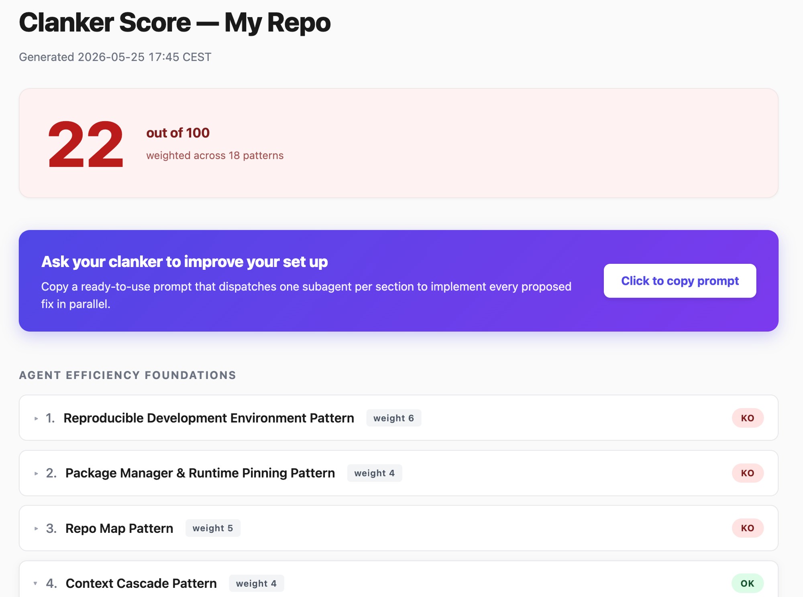

# clanker-score



> Audit whether your repository is optimized for coding-agent efficiency, and get a 0–100 score plus a ready-to-paste prompt to fix every gap.

`clanker-score` is a [Claude Code](https://claude.com/claude-code) skill. It evaluates whether a coding agent (Claude, Cursor, Aider, Codex, …) can quickly understand your repo, safely make changes, verify its own work, and operate with minimal wasted context or hand-holding.

It dispatches one read-only subagent per pattern in parallel, then produces a single self-contained HTML report.

## What it scores

18 patterns grouped into five sections, weighted out of 100:

### Agent Efficiency Foundations
| # | Pattern | Weight |
|---|---|---:|
| 1 | Reproducible Development Environment | 6 |
| 2 | Package Manager & Runtime Pinning | 4 |
| 3 | Repo Map | 5 |
| 4 | Context Cascade | 4 |
| 5 | CLAUDE.md Quality | 10 |

### Context & Tooling
| # | Pattern | Weight |
|---|---|---:|
| 6 | Noise Filter | 6 |
| 7 | Symbol Lookup | 8 |
| 8 | Large-Repo File Discovery | 5 |

### Verification & Safety
| # | Pattern | Weight |
|---|---|---:|
| 9 | Deterministic Checks | 10 |
| 10 | Verifiable Work Loop | 9 |
| 11 | CI Parity | 4 |
| 12 | Fast Feedback / Focused Tests | 6 |
| 13 | Permission Hardening | 6 |
| 14 | Local Config Hygiene | 3 |

### Reusable Agent Workflows
| # | Pattern | Weight |
|---|---|---:|
| 15 | Just-in-Time Skill | 3 |
| 16 | Agent Output / PR Hygiene | 3 |
| 17 | Custom Subagents | 4 |

### Team Rollout & Continuous Improvement
| # | Pattern | Weight |
|---|---|---:|
| 18 | Harness Bundle | 4 |

Each pattern verdict is `OK` (100%), `OK with note` (70%), or `KO` (0%). The total is rounded to the nearest integer.

## The report

The skill writes `clanker-score-<reponame>-<timestamp>.html` (e.g. `clanker-score-my-repo-20260525-1742.html`) at your repo root — a single self-contained file (no external assets) with:

- A large prominent **score banner** (green ≥ 80, amber 60–79, red < 60).
- A **CTA card** under the banner: *"Ask your clanker to improve your set up"* with a **Click to copy prompt** button. Clicking copies a ready-to-paste prompt that dispatches one subagent per section to implement every proposed fix in parallel.
- One foldable card per pattern, each showing:
  1. **Why does it matter?** — fixed pedagogy.
  2. **What good looks like** — fixed pedagogy.
  3. **What's currently in your repo** — evidence the subagent observed.
  4. **What to do to make clanker happy** — concrete remediation (only for `KO`).

## Install

The skill lives under `~/.claude/skills/` for global availability.

```bash
git clone https://github.com/thomasbenhamou/clanker-score.git ~/.claude/skills/clanker-score
```

Or, to scope it to one project, drop it under `<repo>/.claude/skills/clanker-score/` instead.

## Use

From inside a Claude Code session at the root of the repository you want to audit:

```
/clanker-score
```

Claude will dispatch 18 read-only subagents in parallel, then write a timestamped `clanker-score-<reponame>-<timestamp>.html` at the repo root. Open it in your browser, and if you want the gaps fixed, click **Click to copy prompt** and paste the result back into Claude Code (or any other coding agent).

## How it works

- The orchestrator (`SKILL.md`) stays lightweight: it does **not** read all 18 detailed prompts itself.
- Each subagent is told to read `GLOBAL.md` (audit rules, verdict format) plus one pattern-specific prompt under `prompts/`.
- Subagents are strictly read-only — they inspect actual files and config, never edit.
- All 18 `Task` calls are dispatched in a single assistant message so they run concurrently.
- Once results return, the orchestrator computes the weighted score and renders the HTML report, embedding a remediation prompt in a hidden `<textarea>` for the CTA button.

This keeps the orchestrator context small while letting each subagent load only what it needs — a deliberate design choice that matches the very efficiency principles the skill audits.

## Requirements

- [Claude Code](https://claude.com/claude-code) (the CLI, desktop app, or any harness that supports the skill + `Task` subagent format).
- A modern browser to view the HTML report.

The skill itself has no runtime dependencies — everything is Markdown prompts.

## Contributing

Contributions are very welcome — new patterns, sharper remediation, better report styling, fixes to the prompts, language-specific examples, anything that makes the audit more useful.

### Good first contributions

- **Refine a pattern prompt.** Each file under `prompts/` is self-contained; tighten the heuristics, add examples for a language/stack you know well, or fix false positives.
- **Add a new pattern.** Propose it in an issue first (with the gap it closes and a proposed weight). If accepted, add a `prompts/19-…md` and update `SKILL.md` (dispatch list, weights, section assignment, report skeleton).
- **Improve the HTML report.** Better visual design, accessibility, dark mode, charts, etc. — keep it a single self-contained file (no external assets, only the existing CTA script).
- **Add example fixtures.** Sample repos that score well/badly help us reason about edge cases.

### Workflow

1. Fork and create a branch (`feat/<short-name>` or `fix/<short-name>`).
2. Make your changes. For prompt edits, dogfood the skill on a real repo before/after to confirm the verdict still makes sense.
3. Open a PR with:
   - A short summary of the change.
   - The motivating use case (why the current behavior was wrong / incomplete).
   - If you touched a prompt, paste a before/after snippet of the subagent output on a real repo.
4. Be friendly. This is a hobby project — reviews may take a few days.

### Style

- Keep prompts terse, concrete, and evidence-based. No vague advice.
- Remediation must always include file paths, snippets, or commands — never "consider adding X".
- Pattern names are stable; if you must rename, update `SKILL.md` weights and report skeleton in the same PR.

## License

[MIT](./LICENSE) — do what you want, just keep the copyright notice. Contributions are accepted under the same license.
